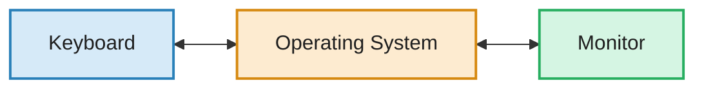
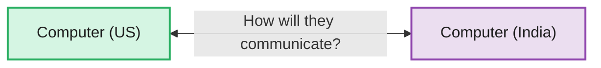
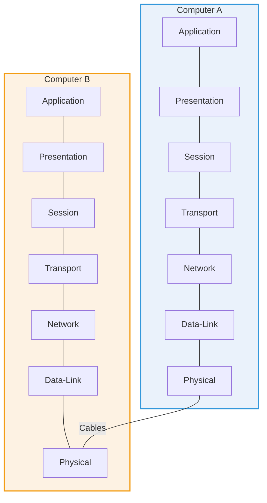
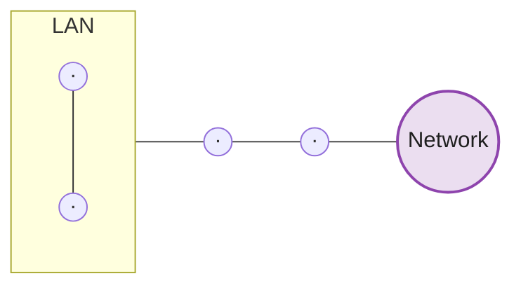

# 🌐 Computer Networks

# Lecture 7: OSI Model

> Address allocation follows a common pattern, whether for mobile phone numbers or IP addresses, and once devices have addresses, they still need a shared framework to actually communicate — this is what the **OSI Model** provides.

---

# Warm-Up: How Phone Numbers Are Allocated

Mobile network operators (Idea, Airtel, Uninor, etc.) require phone numbers for their SIM cards, and the Indian Government allocates blocks of numbers to each of them — this works exactly like IP address allocation.

```text
Phone number = 10 digits (0–9 range)

Idea    → starts with 99________  → 10⁸ possible numbers
Airtel  → starts with 86________  → 10⁸ possible numbers
Uninor  → starts with 932_______  → 10⁷ possible numbers
Tata Docomo → starts with 934____ → 10⁷ possible numbers
```

- Companies needing fewer SIMs (like Uninor) are given a longer fixed prefix, leaving fewer free digits and so a smaller block.
- Companies needing more numbers get a shorter fixed prefix, leaving more free digits and so a bigger block.

**Why the country code (+91)?**

> The same 10-digit number can exist in different countries. The **+91** country code tells the network which country's number is being dialed — this disambiguates numbers globally, similar to how a Network ID disambiguates devices.

```text
10¹⁰ = 1000 crore possible phone numbers in India
India's population ≈ 150 crore
```

---

# Extended Subnetting Example

Take Idea's block: `63.0.0.0`

```text
Host IDs available = 2²⁴ − 2
```

This block is Class C: `198.67.28.0`

```text
[  198.67.28  |   0   ]
    N/w ID     Host ID

2⁸ = 256 total host addresses in this block
```

### Dividing into 4 regional parts (Delhi, UP, UK, Haryana):

```text
256 ÷ 4 = 64 addresses per region
```

| Region | Bit Pattern (first 2 bits of host ID) | Range Size |
|--------|------------------------------------------|-------------|
| Delhi | `00` | 64 |
| UP | `01` | 64 |
| UK | `10` | 64 |
| Haryana | `11` | 64 |

```text
00 000000 → 198.67.28.0 
00 111111 → 198.67.28.63

198.67.28.0/26 (Subnet /26 — showing extended Network ID)
32 - 26 = 6 (Host ID)

2⁸ = 64

01 000000 → 198.67.28.64 
01 111111 → 198.67.28.127
```

```text
198.67.28.0    (Delhi block, subnet /26 — showing extended Network ID)
198.67.28.63   (end of Delhi's range)

198.67.28.0/26        → 2 bits reserved to divide into 4 parts → so 24 + 2 = 26
198.67.28.64 – 127     → Allocated to UP
```

## General Rule for Dividing into Parts

```text
Half distribution (2 parts)  → 1 bit reserved
4 parts                      → 2 bits reserved
8 parts                      → 3 bits reserved
```

> A block can only ever be divided into **powers of 2** — dividing into an odd number of parts is not possible, since each split simply uses one more bit.

---

# OSI Model — Open System Interconnection

## Why Is a Common Model Needed?

Within a single computer, the **Operating System** already lets components like a monitor and keyboard communicate and interact seamlessly.



But now consider two separate computers — one in the US, one in India — that need to talk to each other:



This raises real questions:
- How is data actually transferred between them?
- What protocols will be followed?
- How exactly will an HP machine and a Dell machine understand each other?

> The **OSI Model (Open System Interconnection)** is the standardized framework that answers these questions — a common set of layers that every system agrees to follow, so that any two devices, regardless of manufacturer, can communicate correctly.

## The 7 Layers of OSI

```text
Application
Presentation
Session
Transport
Network
Data-Link
Physical
```



Data is sent layer by layer — starting from Application on the sending side, travelling all the way down to Physical, across the cable, then back up through all 7 layers on the receiving side.

---

# 1. Physical Layer

> Handles how data actually travels at the most fundamental level — as electrical or optical signals over physical media.



## Responsibilities

1. **Cables & Connectors** — the physical wiring that carries signals.
2. **Repeaters** — boost a signal's strength when it weakens over distance, so it can travel further without losing quality.
3. **Data Rate Control** — keeps the speed of data transfer under control (e.g. 3 Mbps, 10 Mbps).
4. **Encoding** — converting a digital signal into an analog signal and back.
5. **Physical Topology** — handling the physical layout being used, such as Bus, Ring, or Star.

---

# 2. Data Link Layer

> Responsible for **Hop-to-Hop Delivery** — moving data reliably across one link at a time, from one intermediate device to the next.


Hop-to-Hop refers to the intermediate path data takes — each hop is one segment of the total journey.

**Analogy: Post Office**


Hop-to-Hop delivery (e.g. Delhi → HR) is the responsibility of the Data Link Layer at each step along the way.

## Layer Count: Router vs Server

| Device | Layers It Operates At |
|----------|---------------------------|
| Router | 3 layers — Network, Data Link, Physical |
| Device / Server | All 7 layers |

## Giving Physical Address — MAC Address

> The Data Link Layer is responsible for assigning the physical address, known as the **MAC Address** (Media/Ethernet Address).

- Windows command to check MAC address: `getmac /v /fo list`
- One device can have multiple MAC addresses — one for each way it can connect to a network, via its **NIC (Network Interface Card)**.

```text
Number of ways to connect to the internet = Number of MAC addresses

Example: WiFi + Cable + Bluetooth = 3 ways → 3 different MAC addresses
```

## Example: Hop-to-Hop Message Structure

```text
[ Sender Address | Receiver Address | Message ]
```

```text
Delhi → HR:        [msg | Delhi | HR]
HR → UP:            [msg | HR | UP]
UP → Gujarat:       [msg | UP | Gujarat]
Gujarat → Mumbai:   [msg | Gujarat | Mumbai]
```

Having a correct address at each hop is critical — otherwise, data could be misdirected to the wrong destination.

```text
[ SIP | Data | RIP ]  → travels through each hop toward the correct destination
```

- Data is transferred using the MAC address at this layer.
- A MAC address is device-specific and is never allocated to any other device.

---

# 📌 Summary

- Address allocation for phone numbers works just like IP addressing — carriers get number blocks sized to their needs, and the +91 country code disambiguates numbers globally, similar to a Network ID.
- Subnetting can split a network block into any number of equal regions, but only in powers of 2 — dividing into 2, 4, or 8 parts reserves 1, 2, or 3 bits respectively; odd splits aren't possible.
- The OSI Model (Open System Interconnection) is a standardized 7-layer framework — Application, Presentation, Session, Transport, Network, Data-Link, and Physical — that lets any two devices, regardless of manufacturer, communicate correctly.
- Data travels down through all 7 layers on the sending side, across the physical medium, and back up through all 7 layers on the receiving side.
- The Physical Layer manages cables and connectors, repeaters (signal boosting), data rate control, encoding (digital-to-analog via modem), and physical topology.
- The Data Link Layer manages Hop-to-Hop delivery and assigns the Physical/MAC Address — a device-specific, unique identifier tied to its Network Interface Card (NIC).
- A device can have multiple MAC addresses, one per way it connects to a network (WiFi, cable, Bluetooth, etc.), while a router typically operates using only its bottom 3 layers (Network, Data Link, Physical), unlike end devices and servers, which use all 7.
